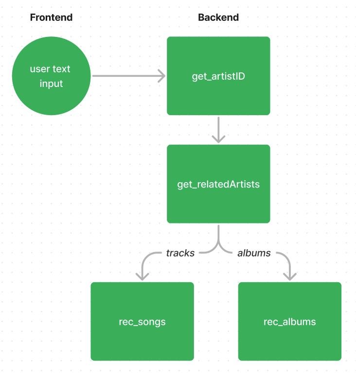

# Implementation 

## Backend

To run the application, first you need to install the Spotipy package, which is a python lightweight web API for the Spotify library, and obtain access the client credentials, both saved in `config.py`.

The `main.py` file contains the core logic of our application. It has a series of functions that interact with the Spotipy API. You can check a summary of the functions below:

| Function     | Description |
| ---------- | ----------- |
| get_artistID    | Returns the artist ID relative to a string argument. Used as the building block to transform user query input into an artist ID. |
| get_relatedArtists  | Returns a list of artist IDs similar to an artist, given their ID as argument. |
| rec_songs     | Returns a dictionary of recommended tracks from a list of artists.  |
| rec_albums   | Returns a dictionary of recommended albums from a list of artists.   |
| get_artist   | Returns the Spotify object of an artist given their ID. Used to display artist name and image in results page.    |

The first two functions, `get_artistID` and `get_relatedArtists`were used as building blocks for the two recommendation functions (`rec_songs` and `rec_albums`). The core logic diagram can be seen below: 

In `get_artistID` function, the user input is searched as artist name. If it is indeed correct, the function returns the artist ID, and the application follows. Else, it returns the correct name found in the Spotify library and render a new page allowing the user to input the correct artist name. 

In `get_relatedArtist` function, the artistID found previously is used to get a list of 10 related artists, according to Spotify. 

In `rec_songs` function, for each of these artists, we randomly sample two of their best tracks - according to Spotify's API top tracks - and return the tracks in a dictionary with their names and main artist.

Similarly, `rec_albums` use the artist IDs list from previous functions to find an album of each related artist, saving and returning an albums dictionary with the albums' names and respective artists.

## Frontend

Flask creates the routes of our application, both rendering the HTML templates and communicating with the backend functions in the `app.py` file.

The main form to handle user input is the standard route, and two other were created: one for each of the recommendation types - tracks or albums.

In the standard one, if the user input is not matched with an existing artist, the form reloads with a suggestion based on the most similar artist name found on Spotify based on the given input.

In each results page, the HTML retrieves not only the recommended albums, but also the target artist image and name. Furthermore, each of the tracks or albums can be clicked so as to listen the recommendation directly on Spotify. Finally, the user can also click the "Shuffle" button, if he/she wants to refresh the list of recommendations for the same target artist.

## Usability

To see how the Damn Good Tracks application work, check the following [video](https://www.loom.com/share/3673c887b84047e990be4aef05e01d91).